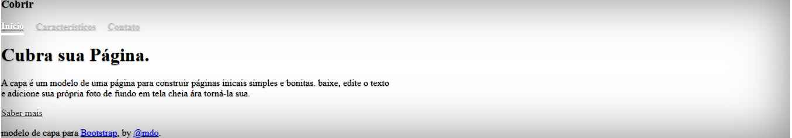

# Índice
 [Projeto - Portfólio para escrita do README](#projeto---portf%C3%B3lio-para-escrita-do-readme)  
 [Descrição](#descri%C3%A7%C3%A3o)  
 [Funcionalidades](#funcionalidades)  
 [Tecnologias utilizadas](#tecnologias-utilizadas)  
 [Fontes consultadas](#fontes-consultadas)  
 [Autores](#autores)  

# 🚀 Projeto - Portfólio para escrita do readme

 
 ## 📋 Descrição
projeto para github use com faz para coluca no github por no Vcode para coluca para github 
depois fico use coluca  img no github mais outro etc
 ## 🔧 Funcionalidades
Vcode use coluca code para github use fisona para github   
codita no Vcode para coluca no github ou detro do github site
 ### 🛠️ Tecnologias utilizadas
-github  
 -html  
 -css  
 -Vcode   
 -png
 -jave            
 ## 📄 Fontes consultadas
* [alura](https://www.alura.com.br/artigos/escrever-bom-readme) - como escrever um README incrível
* [lohhans](https://gist.github.com/lohhans/f8da0b147550df3f96914d3797e9fb89) escrever um README incrível
 ## ✒️ Autores

