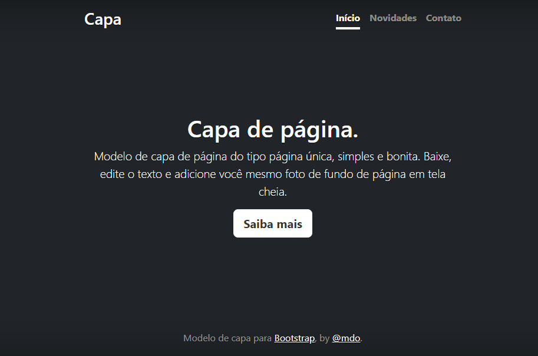

# Índice
 [Projeto - Portfólio para escrita do README](#projeto---portf%C3%B3lio-para-escrita-do-readme)  
 [Descrição](#descri%C3%A7%C3%A3o)  
 [Funcionalidades](#funcionalidades)  
 [Tecnologias utilizadas](#tecnologias-utilizadas)  
 [Fontes consultadas](#fontes-consultadas)  
 [Autores](#autores)  

# 🚀 Projeto - Portfólio para escrita do readme

 
 ## 📋 Descrição
projeto para github use com faz para coluca no github por no Vcode para coluca para github 
depois fico use coluca  img no github mais outro etc
 ## 🔧 Funcionalidades
aberta Vcode depois pocula ums ite copia code use colar no Vcode faz os depois codita no Vcode para github criar arquivos
muito coisa para faz github aberta copia no arqivos no mauso esquedo do batao mostar mais opções
 ### 🛠️ Tecnologias utilizadas
-github  
 -html  
 -css  
 -Vcode   
 -png

-javascript  
 ## 📄 Fontes consultadas
* [alura](https://www.alura.com.br/artigos/escrever-bom-readme) - como escrever um README incrível
* [lohhans](https://gist.github.com/lohhans/f8da0b147550df3f96914d3797e9fb89) escrever um README incrível
 ## ✒️ Autores

